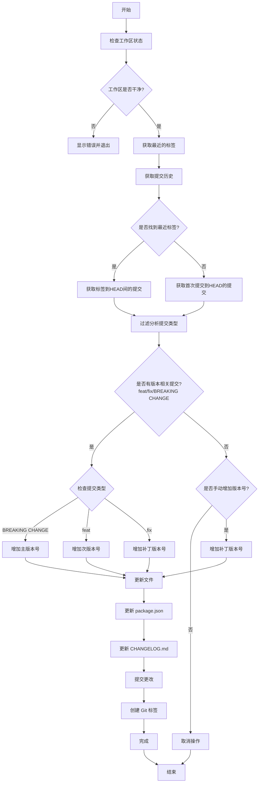

# 版本控制工作流程

本文档详细说明了项目中版本控制脚本 `version.sh` 的工作流程。

## 流程图

## 工作流程说明

### 1. 初始检查

- 脚本首先检查工作区状态，确保没有未提交的更改
- 如果发现未提交的更改，会显示错误信息并退出

### 2. 版本信息获取

- 获取项目最近的 Git 标签作为当前版本
- 如果没有标签，则从 package.json 中读取版本信息
- 如果都没有，则使用 "0.0.0" 作为起始版本

### 3. 提交分析

脚本会分析从上一个版本到现在的所有提交，根据提交信息决定版本号的更新方式：

- **BREAKING CHANGE**: 
  - 增加主版本号
  - 次版本号和补丁版本号重置为 0
  
- **feat**: 
  - 增加次版本号
  - 补丁版本号重置为 0
  
- **fix**: 
  - 增加补丁版本号

### 4. 文件更新

确定新版本号后，脚本会：

1. 更新 `package.json` 中的版本号
2. 更新 `CHANGELOG.md`，添加新版本的变更记录
3. 提交这些更改
4. 创建新的 Git 标签

### 5. 手动控制

在以下情况下，脚本会询问是否要手动增加版本号：

- 没有新的提交
- 提交类型不属于 feat/fix/BREAKING CHANGE

## 使用建议

1. 确保在运行脚本前，所有更改都已提交
2. 遵循约定式提交规范编写提交信息
3. 在确认版本更新信息后再继续操作

## 提交信息规范

为了让版本控制更加准确，提交信息应遵循以下格式：

- `feat: 新功能描述`
- `fix: 修复描述`
- `feat!: 破坏性变更描述` 或 `feat: 描述 BREAKING CHANGE: 破坏性变更说明`

</rewritten_file> 