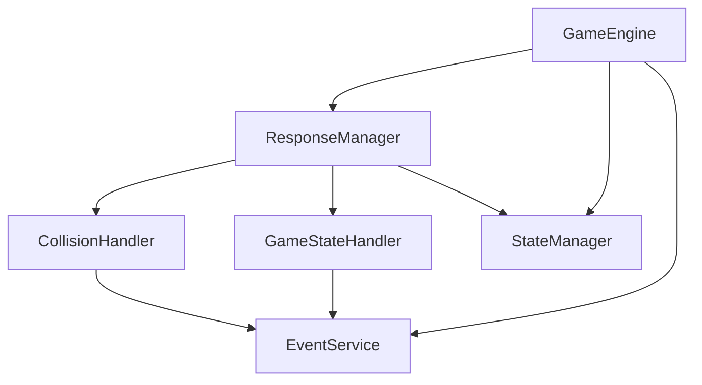

# 核心类关系文档

## 概述

本文档描述了飞机大战游戏引擎中几个核心类之间的关系，主要包括：
- GameEngine（游戏引擎）
- ResponseManager（响应管理器）
- CollisionHandler（碰撞处理器）
- GameStateHandler（游戏状态处理器）

## 类关系图

## 详细关系说明

### GameEngine（游戏引擎）

作为整个游戏的核心控制器，GameEngine 负责：
- 初始化和管理游戏生命周期
- 协调各个管理器之间的交互
- 处理游戏主循环
- 管理游戏状态

它持有以下关键组件的实例：
- ResponseManager：用于处理游戏中的各种事件响应
- StateManager：用于管理游戏状态
- EventService：用于事件分发
- 其他核心服务和管理器

### ResponseManager（响应管理器）

ResponseManager 是一个单例类，作为事件响应的中央处理器：
- 管理和维护所有响应处理器��Handler）
- 负责分发事件到对应的处理器
- 维护对当前游戏状态的引用

主要特点：
- 使用单例模式确保全局只有一个实例
- 通过 Map 结构管理所有响应处理器
- 提供注册和移除处理器的接口

### CollisionHandler（碰撞处理器）

CollisionHandler 继承自 BaseResponseHandler，专门处理游戏中的碰撞事件：
- 处理玩家与敌人的碰撞
- 处理子弹与敌人的碰撞
- 处理子弹与玩家的碰撞

主要职责：
- 计算碰撞后的伤害
- 更新游戏状态（生命值、分数等）
- 触发相关事件（如游戏结束、敌人死亡等）

### GameStateHandler（游戏状态处理器）

GameStateHandler 同样继承自 BaseResponseHandler，负责处理游戏状态相关的事件：
- 游戏初始化
- 游戏开始/暂停/恢复
- 游戏结束
- 游戏重置

主要职责：
- 初始化游戏状态
- 管理游戏生命周期状态转换
- 重置游戏数据

## 交互流程

1. 事件触发流程：
   - GameEngine 在游戏循环中产生事件
   - 通过 EventService 发送事件
   - ResponseManager 接收事件并分发给对应的 Handler
   - Handler 处理事件并更新游戏状态

2. 状态管理流程：
   - GameStateHandler 负责游戏状态的转换
   - StateManager 维护状态数据
   - 其他组件通�� StateManager 访问和更新状态

3. 碰撞处理流程：
   - GameEngine 检测碰撞
   - 通过 EventService 发送碰撞事件
   - CollisionHandler 处理碰撞逻辑
   - 更新游戏状态并可能触发其他事件

## 设计特点

1. 单一职责原则：
   - 每个类都有明确的职责
   - Handler 类专注于特定类型的事件处理

2. 依赖注入：
   - 通过构造函数注入依赖
   - 使用单例模式管理全局服务

3. 事件驱动：
   - 使用事件系统实现松耦合
   - 通过 EventService 统一管理事件

4. 可扩展性：
   - 可以方便地添加新的响应处理器
   - 事件系统支持自定义事件类型 