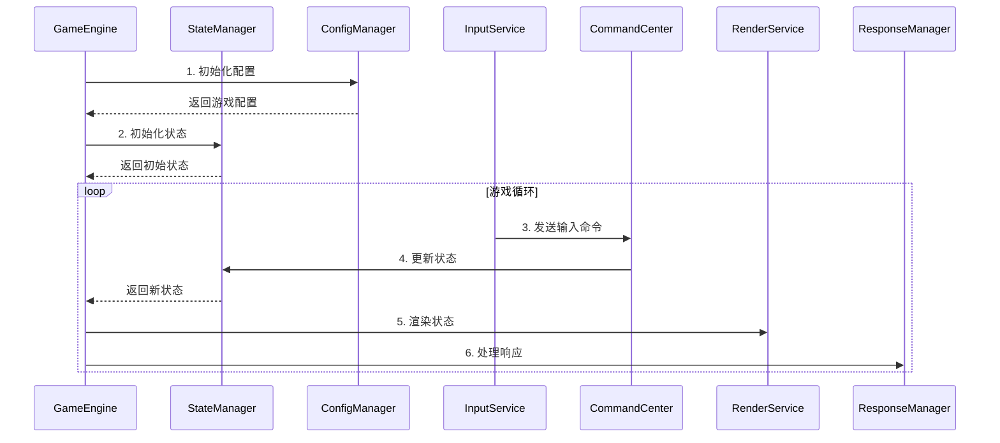

# 数据流

## 组件交互图

## 核心组件

1. **游戏引擎 (GameEngine)**
   - 游戏的核心控制器
   - 负责协调各个组件的工作
   - 管理游戏生命周期

2. **状态管理器 (StateManager)**
   - 维护游戏状态
   - 处理状态更新
   - 提供状态查询接口

3. **配置管理器 (ConfigManager)**
   - 管理游戏配置
   - 提供配置更新接口
   - 处理配置持久化

4. **命令中心 (CommandCenter)**
   - 处理游戏命令
   - 转换输入为状态更新
   - 管理命令队列

5. **渲染服务 (RenderService)**
   - 管理画布上下文
   - 协调渲染器工作
   - 处理渲染性能

6. **响应管理器 (ResponseManager)**
   - 处理游戏响应
   - 管理事件监听
   - 触发游戏效果 