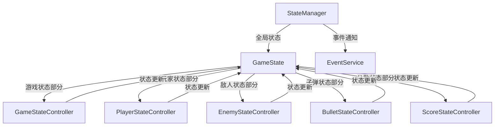

# 飞机大战游戏状态管理系统数据流

## 核心组件

### StateManager（状态管理器）
- 作为整个游戏状态的中央管理器
- 维护全局 GameState
- 协调各个子状态控制器
- 通过 EventService 发送状态变更通知

### 子状态控制器
1. GameStateController（游戏状态控制器）
2. PlayerStateController（玩家状态控制器）
3. EnemyStateController（敌人状态控制器）
4. BulletStateController（子弹状态控制器）
5. ScoreStateController（分数状态控制器）

## 数据流向



## 状态更新流程

1. StateManager 初始化
   - 创建初始 GameState
   - 初始化所有子状态控制器
   - 设置事件监听

2. 游戏循环中的状态更新
   ```
   StateManager.updateState(deltaTime)
   ├── 更新游戏时间和性能指标
   ├── GameStateController.update()  // 更新游戏整体状态
   ├── PlayerStateController.update() // 更新玩家状态
   ├── EnemyStateController.update()  // 更新敌人状态
   ├── BulletStateController.update() // 更新子弹状态
   └── 触发状态变更事件
   ```

## 各控制器职责

### GameStateController
- 管理游戏进度（关卡、波次）
- 检查游戏结束条件
- 控制游戏状态转换（初始化、运行、暂停、结束）

### PlayerStateController
- 处理玩家移动
- 更新玩家属性（生命值、无敌状态等）
- 管理武器冷却
- 处理连击系统

### EnemyStateController
- 管理敌人移动
- 处理敌人生成和销毁
- 维护敌人状态列表

### BulletStateController
- 更新子弹位置
- 处理子弹碰撞检测
- 管理子弹生命周期

### ScoreStateController
- 计算和更新分数
- 管理连击奖励
- 处理得分事件

## 状态数据结构

```typescript
GameState {
    status: GameStatus
    currentLevel: number
    currentWave: number
    score: number
    time: number
    isPaused: boolean
    isGameOver: boolean
    performance: PerformanceMetrics
    player: PlayerState
    enemies: EnemyState[]
    bullets: BulletState[]
    powerups: PowerupState[]
    input: InputState
}
```

## 注意事项

1. 状态更新的原子性
   - 所有状态更新都通过 StateManager 进行
   - 避免直接修改 GameState

2. 事件通知
   - 状态变更通过 EventService 通知
   - 确保状态更新后触发相应事件

3. 性能考虑
   - 状态更新在每帧进行
   - 需要注意大量实体时的性能优化 