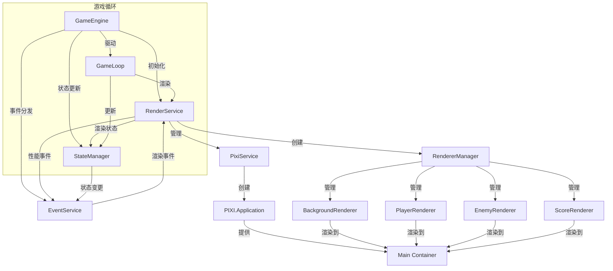
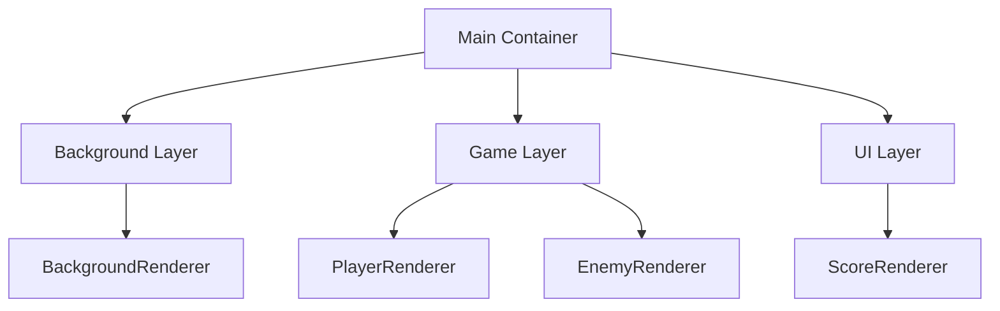

# 游戏引擎与渲染服务关系说明

## 整体架构



## 核心职责划分

### GameEngine（游戏引擎）
- **渲染相关职责**
  - 初始化渲染服务
  - 控制渲染时机
  - 管理渲染配置
  - 处理渲染性能监控

- **生命周期管理**
  - 创建和初始化渲染服务
  - 同步渲染和游戏状态
  - 处理渲染资源的释放
  - 管理渲染循环

### RenderService（渲染服务）
- **核心功能**
  - 管理渲染器注册
  - 协调渲染流程
  - 处理渲染性能
  - 提供调试支持

- **状态同步**
  - 接收游戏状态
  - 分发状态到渲染器
  - 维护渲染一致性

### RendererManager（渲染器管理器）
- **核心功能**
  - 统一管理所有渲染器实例
  - 处理渲染器的注册和初始化
  - 维护主渲染容器
  - 协调渲染器之间的关系

- **生命周期管理**
  - 创建和初始化渲染器
  - 管理渲染器的容器层级
  - 处理渲染器的销毁
  - 提供调试模式支持

## 渲染器层级结构



## 交互流程

### 1. 初始化阶段
```typescript
GameEngine.constructor
├── 创建配置管理器
├── 创建状态管理器
├── 初始化渲染服务
│   ├── 创建 PixiJS 应用
│   ├── 创建 RendererManager
│   │   ├── 初始化主容器
│   │   ├── 注册背景渲染器
│   │   ├── 注册玩家渲染器
│   │   ├── 注册敌人渲染器
│   │   └── 注册得分渲染器
│   └── 设置渲染配置
└── 设置事件监听
```

### 2. 游戏循环中的渲染流程
```typescript
GameEngine.gameLoop
├── 计算时间增量
├── 更新游戏状态
├── RenderService.render(state)
│   ├── 更新性能指标
│   ├── RendererManager.render()
│   │   ├── BackgroundRenderer.render()
│   │   ├── PlayerRenderer.render()
│   │   ├── EnemyRenderer.render()
│   │   └── ScoreRenderer.render()
│   └── 发送渲染事件
└── 请求下一帧
```

## 渲染器管理

### 1. 渲染器注册流程
```typescript
RendererManager.registerRenderer(name, renderer)
├── 添加到渲染器集合
├── 设置容器关系
├── 配置渲染顺序
└── 注册到渲染服务
```

### 2. 渲染器生命周期
```typescript
Renderer Lifecycle
├── 创建实例
├── 初始化配置
├── 设置容器
├── 渲染循环
└── 销毁清理
```

## 关键交互点

1. **状态同步**
   ```typescript
   GameEngine
   ├── 状态更新
   ├── 调用渲染服务
   └── 等待渲染完成
   ```

2. **性能监控**
   ```typescript
   RenderService
   ├── 收集性能指标
   ├── 发送性能事件
   └── 更新统计信息
   ```

3. **资源管理**
   ```typescript
   GameEngine
   ├── 加载资源
   ├── 传递到渲染服务
   └── 管理资源生命周期
   ```

## 事件通信

### 1. 引擎到渲染服务
- GAME_START：开始渲染
- GAME_PAUSE：暂停渲染
- GAME_RESUME：恢复渲染
- GAME_STOP：停止渲染

### 2. 渲染服务到引擎
- RENDER_FRAME：帧渲染完成
- RENDER_ERROR：渲染错误
- PERFORMANCE_UPDATE：性能指标更新

## 性能优化

### 1. 渲染优化策略
- **引擎层面**
  - 智能跳帧
  - 状态批量更新
  - 渲染优先级管理

- **渲染服务层面**
  - 渲染队列优化
  - 资源动态加载
  - 离屏渲染

### 2. 性能监控指标
- 帧率（FPS）
- 渲染时间
- 内存使用
- 渲染批次

## 调试支持

### 1. 引擎调试功能
- 游戏状态检查
- 性能监控面板
- 事件追踪

### 2. 渲染调试功能
- 渲染边界显示
- 性能统计
- 渲染层级可视化

## 错误��理

### 1. 引擎层面
```typescript
try {
  renderService.render(state);
} catch (error) {
  handleRenderError(error);
  fallbackRender();
}
```

### 2. 渲染服务层面
```typescript
try {
  renderer.render(state);
} catch (error) {
  logRenderError(error);
  useEmergencyRenderer();
}
```

## 最佳实践

1. **状态管理**
   - 保持状态的不可变性
   - 使用状态快照进行渲染
   - 避免渲染时修改状态

2. **性能优化**
   - 实现智能渲染调度
   - 使用渲染缓存
   - 优化渲染批次

3. **资源管理**
   - 实现资源预加载
   - 管理资源生命周期
   - 优化资源使用

## 扩展建议

1. **添加新功能**
   - 保持引擎与渲染服务的解耦
   - 遵循现有的事件机制
   - 实现必要的性能监控

2. **自定义渲染**
   - 继承现有渲染接口
   - 实现必要的生命周期方法
   - 注意性能影响

3. **调试增强**
   - 添加自定义调试视图
   - 扩展性能监控指标
   - 提供更多调试工具 