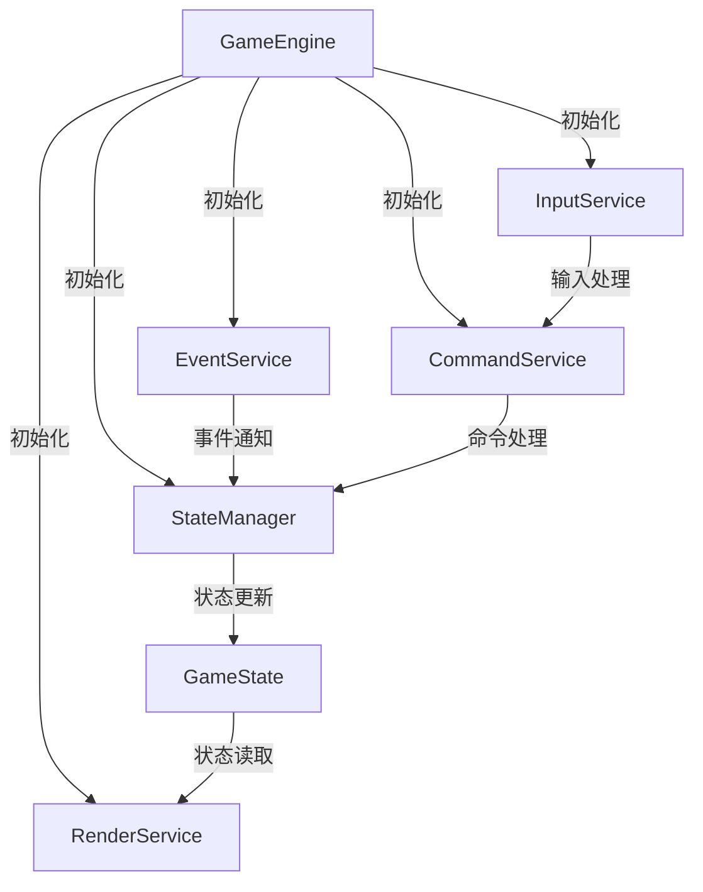
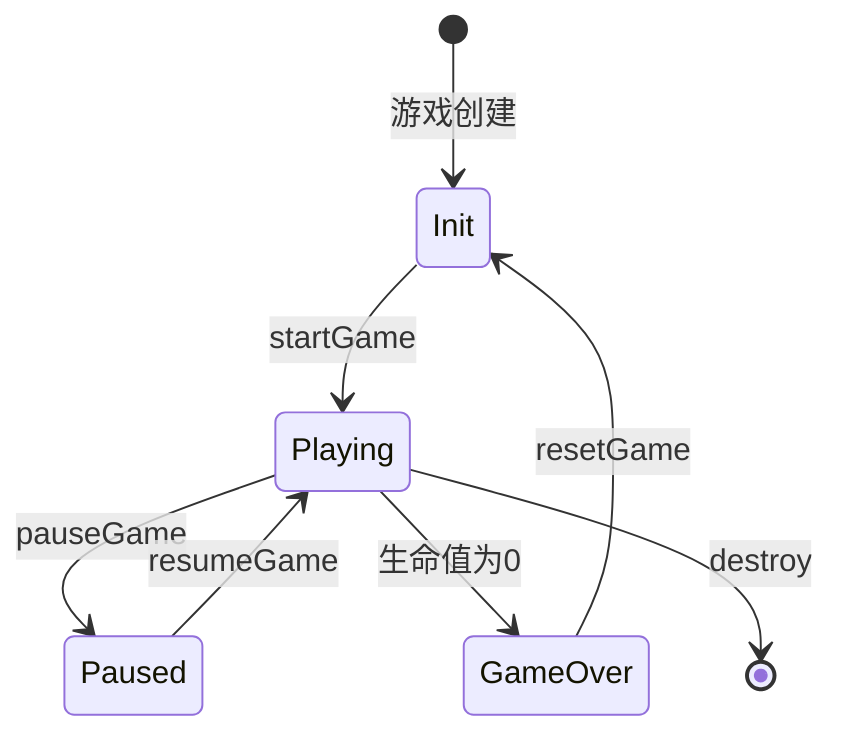

# 游戏引擎与状态管理关系说明

## 整体架构



## 核心职责划分

### GameEngine（游戏引擎）
- **生命周期管理**
  - 负责游戏的启动、暂停、恢复和结束
  - 控制游戏主循环（Game Loop）
  - 管理帧率和时间增量

- **组件协调**
  - 初始化并协调各个核心服务
  - 确保各个管理器之间的正确通信
  - 提供统一的对外接口

- **性能监控**
  - 跟踪帧率和性能指标
  - 管理游戏循环的时间控制
  - 处理性能优化相关的任务

### StateManager（状态管理器）
- **状态维护**
  - 集中管理游戏状态数据
  - 确保状态更新的原子性
  - 提供状态查询接口

- **状态同步**
  - 协调各个子状态控制器
  - 确保状态更新的顺序
  - 触发状态变更事件

## 交互流程

### 1. 初始化阶段
```typescript
GameEngine
├── 创建 StateManager
├── 初始化核心服务
│   ├── EventService
│   ├── CommandService
│   ├── RenderService
│   └── InputService
└── 设置初始游戏状态
```

### 2. 游戏循环阶段
```typescript
GameLoop
├── 计算时间增量 (deltaTime)
├── StateManager.updateState(deltaTime)
│   ├── 更新游戏状态
│   ├── 更新各个子状态
│   └── 触发状态变更事件
├── RenderService.render(currentState)
└── 请求下一帧动画
```

### 3. 状态变更流程
```typescript
Input/Command -> StateManager -> EventService -> Renderers
```

## 关键交互点

1. **状态更新**
   - GameEngine 通过 gameLoop 触发状态更新
   - StateManager 执行实际的状态更新逻辑
   - 状态更新后通过 EventService 通知相关组件

2. **组件处理**
   - GameEngine 注册核心游戏事件监听
   - StateManager 处理状态相关的事件
   - 通过 EventService 实现解耦通信

3. **渲染同步**
   - GameEngine 控制渲染时机
   - StateManager 提供最新的游戏状态
   - RenderService 根据状态执行渲染

## 状态流转图



## 最佳实践

1. **状态管理原则**
   - 所有状态修改必须通过 StateManager
   - 状态更新应该是可预测的
   - 保持状态的不可变性

2. **性能优化**
   - 避免在游戏循环中进行重复计算
   - 合理使用事件系统，避免过多的事件触发
   - 状态更新应该高效且可控

3. **错误处理**
   - GameEngine 负责全局错误捕获
   - StateManager 确保状态一致性
   - 提供状态回滚机制

## 调试建议

1. **状态调试**
   - 使用 getState() 方法查看当前状态
   - 监听状态变更事件进行调试
   - 使用性能监控工具分析状态更新性能

2. **引擎调试**
   - 设置 debug 模式获取详细日志
   - 监控游戏循环性能
   - 使用开发者工具分析渲染性能 