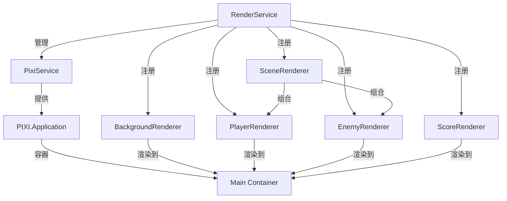

# 渲染系统架构说明

## 整体架构



## 核心组件职责

### RenderService（渲染服务）
- **核心功能**
  - 初始化和管理 PixiJS 应用实例
  - 管理渲染器的注册和注销
  - 协调整体渲染流程
  - 处理性能统计和调试信息

- **生命周期管理**
  - 初始化渲染环境
  - 管理渲染器的创建和销毁
  - 处理渲染循环
  - 资源清理

### 具体渲染器

#### BackgroundRenderer（背景渲染器）
- 创建和管理滚动背景
- 处理背景动画效果
- 管理背景层级和深度

#### PlayerRenderer（玩家渲染器）
- 渲染玩家���机精灵
- 处理玩家动画效果
- 更新玩家位置和状态
- 提供调试视图

#### EnemyRenderer（敌人渲染器）
- 管理敌人精灵池
- 处理敌人的创建和销毁
- 更新敌人位置和状态
- 提供碰撞检测视图

#### ScoreRenderer（得分渲染器）
- 渲染得分信息
- 更新得分显示
- 处理得分动画效果

#### SceneRenderer（场景渲染器）
- 组合管理其他渲染器
- 控制渲染顺序
- 处理场景切换
- 管理全局渲染状态

## 渲染流程

### 1. 初始化流程
```typescript
RenderService.initialize()
├── 创建 PixiJS 应用
├── 设置渲染配置
├── 初始化渲染器
│   ├── BackgroundRenderer
│   ├── PlayerRenderer
│   ├── EnemyRenderer
│   ├── ScoreRenderer
│   └── SceneRenderer
└── 设置事件监听
```

### 2. 渲染循环
```typescript
RenderService.render(state)
├── 更新性能统计
├── 调用各渲染器的render方法
│   ├── BackgroundRenderer.render()
│   ├── SceneRenderer.render()
│   │   ├── PlayerRenderer.render()
│   │   └── EnemyRenderer.render()
│   └── ScoreRenderer.render()
└── 处理调试信息
```

## 渲染器接口规范

所有渲染器都实现 `GameRenderer` 接口：

```typescript
interface GameRenderer {
    initialize(config: GameConfig, canvas: HTMLCanvasElement): void;
    render(state: GameState): void;
    setDebug(enabled: boolean): void;
    getStats(): RenderStats;
    destroy(): void;
}
```

## 状态更新与渲染同步

1. **状态到渲染的映射**
   - 游戏状态变更触发渲染更新
   - 渲染器从状态中读取必要信息
   - 确保渲染与状态同步

2. **性能优化策略**
   - 使用精灵池管理游戏对象
   - 实现按需渲染
   - 优化渲染批次

## 调试功能

### 1. 调试视图
- 显示碰撞边界
- 显示性能统计
- 显示精灵信息

### 2. 性能监控
- FPS 统计
- 渲染批次统计
- 实体数量统计

## 最佳实践

1. **渲染器开发规范**
   - 遵循单一职责原则
   - 实现必要的生命周期方法
   - 提供完整的调试支持
   - 注意资源的及时释放

2. **性能优化建议**
   - 合理使用对象池
   - 控制渲染批次
   - 优化资源加载
   - 实现按需渲染

3. **错误处理**
   - 优雅处理资源加载失败
   - 提供降级渲染方案
   - 完善错误日志

## 注意事项

1. **资源管理**
   - 及时清理不需要的资源
   - 使用纹理图集优化性能
   - 实现资源的预加载

2. **渲染同步**
   - 确保渲染器状态一��性
   - 处理好渲染顺序
   - 避免不必要的重绘

3. **扩展性考虑**
   - 保持渲染器的独立性
   - 提供灵活的配置选项
   - 支持自定义渲染效果 