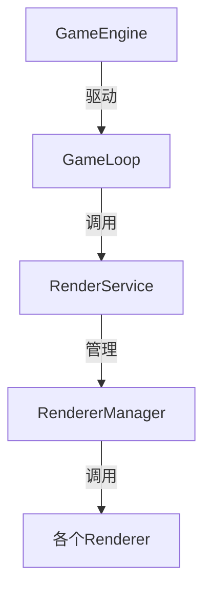

# 渲染器调用链分析

## 调用链概述

游戏引擎中渲染器的调用链如下：



## 详细调用过程

1. **源头调用**
   - GameEngine 通过游戏循环（GameLoop）驱动整个渲染过程
   - 在每一帧中，GameLoop 会调用 RenderService 的 render 方法

2. **RenderService 层**
   - RenderService 作为渲染服务的核心，接收来自 GameLoop 的渲染请求
   - 在其 render 方法中，会遍历所有注册的渲染器进行渲染
   ```typescript
   render(state: GameState): void {
     // 调用所有注册的渲染器进行渲染
     for (const renderer of this.renderers) {
       renderer.render(state);
     }
   }
   ```

3. **RendererManager 层**
   - RendererManager 负责管理所有渲染器实例
   - 它在初始化时注册了各个渲染器：
     - BackgroundRenderer（背景渲染）
     - PlayerRenderer（玩家渲染）
     - EnemyRenderer（敌人渲染）
     - ScoreRenderer（分数渲染）
     - 其他UI渲染器

4. **具体渲染器**
   每个渲染器都实现了 GameRenderer 接口，在收到 render 调用时执行自己的渲染逻辑：
   - BackgroundRenderer：渲染游戏背景
   - PlayerRenderer：渲染玩家飞机
   - EnemyRenderer：渲染敌机
   - ScoreRenderer：渲染分数
   - StartButtonRenderer：渲染开始按钮
   - UIRenderer：管理和渲染所有UI组件

## 渲染顺序

渲染器的调用顺序是由注册顺序决定的，通常为：
1. 背景层（BackgroundRenderer）
2. 游戏对象层（PlayerRenderer、EnemyRenderer）
3. UI层（ScoreRenderer、StartButtonRenderer等）

## 性能优化

在渲染调用链中实现了多项性能优化：
1. 使用 PixiJS 进行高效渲染
2. 实现帧率控制和性能监控
3. 渲染器按需更新
4. 使用对象池管理游戏对象

## 调试支持

整个调用链都支持调试模式：
1. 可以显示渲染边界
2. 输出性能统计信息
3. 记录详细的渲染日志
4. 支持渲染器单独开启/关闭调试 